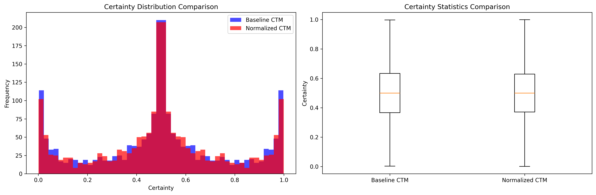

# Continuous Thought Machine with Neuron-Level Normalization

This implementation extends the original Continuous Thought Machine (CTM) architecture with biologically-inspired neuron-level normalization to improve training stability, biological plausibility, and interpretability of neural synchrony.

## Overview

The neuron-level normalization introduces biologically plausible intrinsic normalization into CTM, where each neuron's activation is normalized using running statistics maintained per neuron. This approach is inspired by biological neural systems where neurons maintain their own activity levels through **homeostatic mechanisms**.

### Biological Motivation: Homeostatic Mechanisms

For more background, see [Intrinsic Plasticity (Wikipedia)](https://en.wikipedia.org/wiki/Nonsynaptic_plasticity#Intrinsic_plasticity).

In biological neural systems, neurons exhibit **homeostatic plasticity** - the ability to maintain stable firing rates despite changes in input conditions. This is achieved through several mechanisms:

1. **Synaptic Scaling**: Neurons adjust the strength of all their synapses proportionally
2. **Intrinsic Plasticity**: Neurons modify their own excitability (firing threshold, membrane properties)
3. **Temporal Adaptation**: Neurons adapt their response based on recent activity history

Our temporal normalization approach directly models this third mechanism, where each neuron maintains a running estimate of its own activity statistics and uses this to normalize its current activation. This creates a form of **intrinsic homeostasis** where neurons self-regulate their activity levels.

## Mathematical Foundation

### 1. Temporal Normalization (Primary Method)

The temporal normalization uses the neuron's activation history to compute normalization statistics:

#### Mathematical Formulation

For neuron $i$ at time $t$, let $z_i^t$ be the raw activation and $Z_i^{t-M:t-1}$ be the activation history over the last $M$ time steps.

**Trace Statistics:**

$$\mu_i^{\text{trace}} = \frac{1}{M} \sum_{k=t-M}^{t-1} z_i^k$$

$$\sigma_i^{2,\text{trace}} = \frac{1}{M} \sum_{k=t-M}^{t-1} (z_i^k - \mu_i^{\text{trace}})^2$$

**Normalized Activation:**

$$\hat{z}_i^t = \frac{z_i^t - \mu_i^{\text{trace}}}{\sqrt{\sigma_i^{2,\text{trace}} + \epsilon}}$$

#### Biological Interpretation

This approach directly models **temporal adaptation** in biological neurons:
- **Short-term plasticity**: Neurons adapt their response based on recent activity
- **Homeostatic regulation**: Prevents runaway excitation or depression
- **Temporal context**: Each neuron maintains its own activity history

### 2. Batch Normalization (Fallback Method)

When temporal history is unavailable, we fall back to batch-based normalization:

#### Mathematical Formulation

For a batch of $B$ samples, let $z_i^b$ be the activation of neuron $i$ in sample $b$.

**Batch Statistics:**

$$\mu_i^{\text{batch}} = \frac{1}{B} \sum_{b=1}^{B} z_i^b$$

$$\sigma_i^{2,\text{batch}} = \frac{1}{B} \sum_{b=1}^{B} (z_i^b - \mu_i^{\text{batch}})^2$$

**Running Statistics Update (Exponential Moving Average):**

$$\mu_i^{\text{running}}(t) = (1-\alpha) \cdot \mu_i^{\text{running}}(t-1) + \alpha \cdot \mu_i^{\text{batch}}$$

$$\sigma_i^{2,\text{running}}(t) = (1-\alpha) \cdot \sigma_i^{2,\text{running}}(t-1) + \alpha \cdot \sigma_i^{2,\text{batch}}$$

**Normalized Activation:**

$$\hat{z}_i^t = \frac{z_i^t - \mu_i^{\text{running}}}{\sqrt{\sigma_i^{2,\text{running}} + \epsilon}}$$

#### Biological Interpretation

Batch normalization models **population-level homeostasis**:
- **Cross-neuron regulation**: Statistics computed across multiple neurons
- **Stable reference**: Provides a stable baseline for normalization
- **Adaptive scaling**: Neurons adapt to the overall population activity

## Implementation Details

### Normalization Formula

The normalized activation for neuron $i$ at time $t$ is computed as:

$$\hat{z}_i^t = \frac{z_i^t - \mu_i}{\sqrt{\sigma_i^2 + \epsilon}}$$

Where:
- $z_i^t$ is the raw activation of neuron $i$ at time $t$
- $\mu_i$ is the running mean for neuron $i$
- $\sigma_i^2$ is the running variance for neuron $i$  
- $\epsilon = 10^{-5}$ is a small constant for numerical stability
- The decay factor $\alpha = 0.01$ controls how quickly statistics are updated


## Results Discussion

Our experiments indicate that batch normalization leads to degraded performance on the maze task. Therefore, we focus our analysis on the temporal normalization technique, which demonstrated performance comparable to the baseline model.

## Small Maze Task Results

When training and evaluating the temporal normalization method alongside the baseline on the small maze task, we observed nearly identical performance. Both models were trained for 20 epochs. During the initial three epochs, the temporal normalization model exhibited lower performance, but after the third epoch, its results closely matched those of the baseline. We also examined the distribution of neuron certainty, finding similar behavior between the two models. In fact, the temporal normalization model achieved slightly better loss and accuracy than the baseline, though the improvement was marginal.




## Medium Maze Task Results

For the medium maze task, we conducted experiments using both the baseline CTM and the neuron-level temporal normalization method. Due to limited computational resources, we did not perform extensive hyperparameter tuning. Instead, we focused on running longer training sessions and adapted the Jupyter notebook from the original CTM repository (see `examples/03_mazes_normalized_baseline_comparison.ipynb` for full details and additional results).

Below, we present the accuracy and loss curves for both models (top: baseline, bottom: temporal normalization). As observed in the small maze experiments, the temporal normalization model initially exhibits higher loss and lower accuracy during the early epochs. However, it quickly catches up and converges to performance levels similar to the baseline. Notably, both models show comparable metrics throughout most of the training process. Towards the later epochs, the temporal normalization model's improvement plateaus slightly earlier than the baseline, suggesting potential room for further optimization or tuning.

For a more comprehensive analysis and additional visualizations, please refer to the linked notebook.


## Code Changes Made

### 1. Enhanced CTM Model (`models/ctm.py`)

#### New Parameters Added:
```python
def __init__(self, 
             # ... existing parameters ...
             use_neuron_normalization=False,  # New parameter for neuron-level normalization
             normalization_decay=0.01,  # Decay factor for running statistics
             normalization_epsilon=1e-5,  # Epsilon for numerical stability
             ):
```

#### New Normalization Method:
```python
def normalize_activations(self, activated_state, state_trace=None):
    """
    Apply neuron-level normalization to post-activations based on trace history.
    
    This implements biologically-inspired normalization where each neuron's activation
    is normalized using statistics computed from its trace history.
    
    Args:
        activated_state (torch.Tensor): Post-activations of shape (B, d_model)
        state_trace (torch.Tensor): Pre-activation trace history of shape (B, d_model, memory_length)
        
    Returns:
        torch.Tensor: Normalized activations of same shape
    """
    if not self.use_neuron_normalization:
        return activated_state
        
    # activated_state shape: (B, d_model)
    B, d_model = activated_state.shape
    
    if state_trace is not None and state_trace.size(-1) > 0:
        # Use trace-based normalization
        # Compute statistics from the trace history for each neuron
        # state_trace shape: (B, d_model, memory_length)
        
        # Compute mean and variance across the trace dimension for each neuron
        trace_mean = state_trace.mean(dim=-1)  # Shape: (B, d_model)
        trace_var = state_trace.var(dim=-1, unbiased=False)  # Shape: (B, d_model)
        
        # Normalize using trace statistics
        # Formula: ẑ_i^t = (z_i^t - μ_i^trace) / √(σ_i^2^trace + ε)
        normalized_state = (activated_state - trace_mean) / torch.sqrt(trace_var + self.normalization_epsilon)
        
    else:
        # Fallback to batch-based normalization (original method)
        if self.training:
            # Compute current batch statistics per neuron
            batch_mean = activated_state.mean(dim=0)  # Shape: (d_model,)
            batch_var = activated_state.var(dim=0, unbiased=False)  # Shape: (d_model,)
            
            # Update running statistics using exponential moving average
            if self.num_batches_tracked == 0:
                # First batch: initialize with batch statistics
                self.running_mean = batch_mean.detach()
                self.running_var = batch_var.detach()
            else:
                # Update using decay factor α = 0.01
                alpha = self.normalization_decay
                self.running_mean = ((1 - alpha) * self.running_mean + alpha * batch_mean).detach()
                self.running_var = ((1 - alpha) * self.running_var + alpha * batch_var).detach()
            
            self.num_batches_tracked += 1
        
        # Normalize using running statistics
        # Formula: ẑ_i^t = (z_i^t - μ_i) / √(σ_i^2 + ε)
        normalized_state = (activated_state - self.running_mean.unsqueeze(0)) / torch.sqrt(self.running_var.unsqueeze(0) + self.normalization_epsilon)
    
    return normalized_state
```

#### Integration Points in Forward Pass:
```python
def forward(self, x, track=False):
    # ... existing code ...
    
    # --- Apply Initial Neuron-Level Normalization ---
    activated_state = self.normalize_activations(activated_state, state_trace)
    
    # ... existing code ...
    
    for stepi in range(self.iterations):
        # ... existing code ...
        
        # --- Apply Neuron-Level Models ---
        activated_state = self.trace_processor(state_trace)
        
        # --- Apply Neuron-Level Normalization ---
        activated_state = self.normalize_activations(activated_state, state_trace)
        
        # ... existing code ...
```

#### New Buffers for Running Statistics:
```python
# --- Neuron Normalization Buffers ---
if self.use_neuron_normalization:
    # Register buffers for running mean and variance per neuron
    self.register_buffer('running_mean', torch.zeros(d_model))
    self.register_buffer('running_var', torch.ones(d_model))
    self.register_buffer('num_batches_tracked', torch.tensor(0, dtype=torch.long))
```

### 2. New Normalized CTM Class (`models/ctm_normalized.py`)

Created a specialized class that enables normalization by default:

```python
class NormalizedContinuousThoughtMachine(ContinuousThoughtMachine):
    """
    Continuous Thought Machine with Neuron-Level Normalization.

    This extends the original CTM by adding biologically-inspired neuron-level normalization
    of post-activations at each internal tick. The normalization maintains running mean μ_i
    and variance σ_i² per neuron, updated using a decay factor α = 0.01.

    The normalized activations are computed as:
        ẑ_i^t = (z_i^t - μ_i) / √(σ_i² + ε)
    
    where ε = 10⁻⁵ for numerical stability.

    This normalization is applied to:
    - The history buffer Ẑ^t
    - Synchronization matrix S^t = Ẑ^t (Ẑ^t)^⊤
    - Inputs to the synapse model
    """

    def __init__(self, ...):
        # Call parent constructor with normalization enabled
        super().__init__(
            # ... existing parameters ...
            use_neuron_normalization=True,  # Enable normalization by default
            normalization_decay=normalization_decay,
            normalization_epsilon=normalization_epsilon,
        )
```

### 3. Factory Functions for Easy Model Creation

```python
def create_ctm_with_normalization(config):
    """Factory function to create a CTM with neuron-level normalization."""
    return NormalizedContinuousThoughtMachine(...)

def create_baseline_ctm(config):
    """Factory function to create a baseline CTM without normalization."""
    return ContinuousThoughtMachine(
        # ... existing parameters ...
        use_neuron_normalization=False,  # Disable normalization for baseline
    )
```


## License

This implementation follows the same license as the original CTM codebase. 